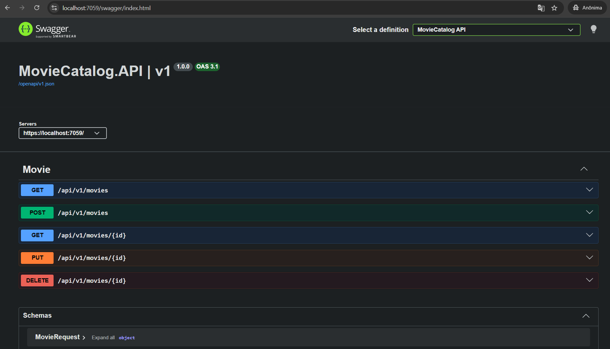
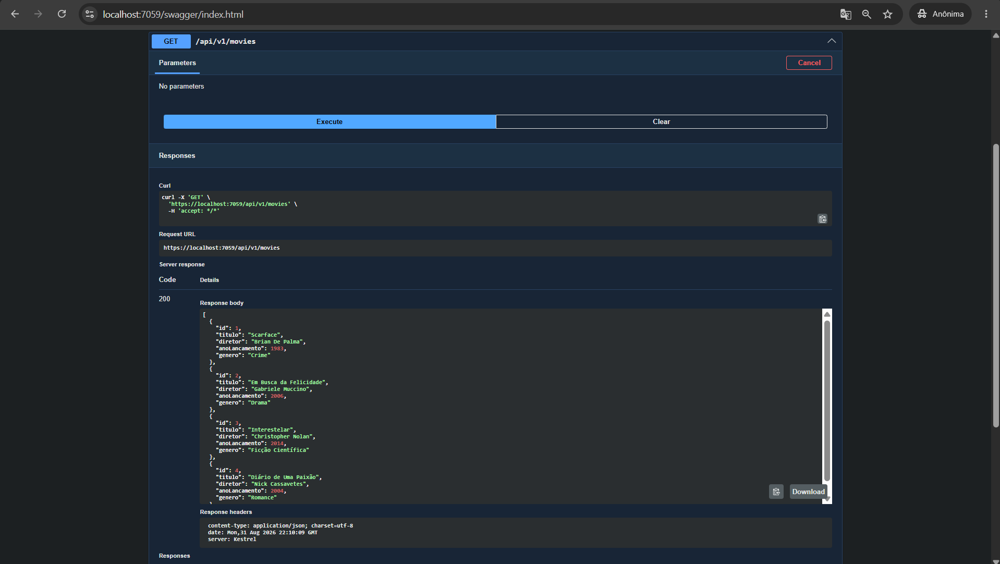
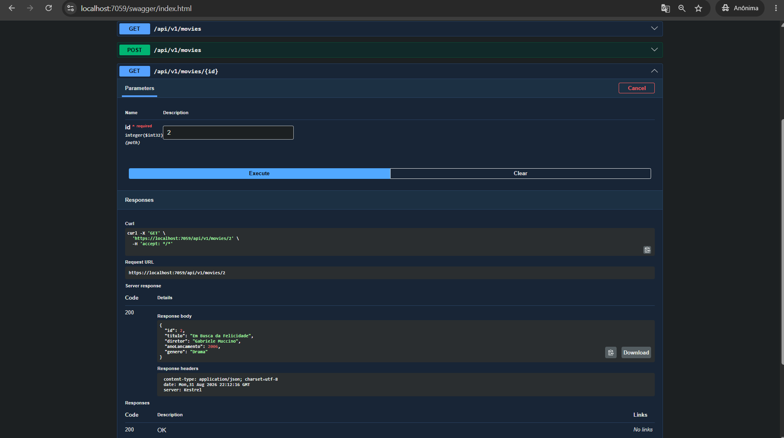
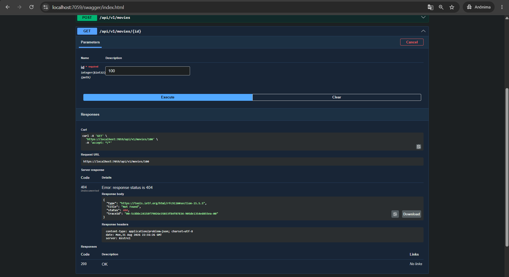
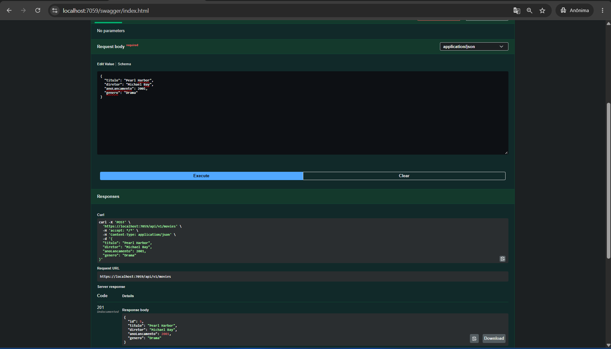
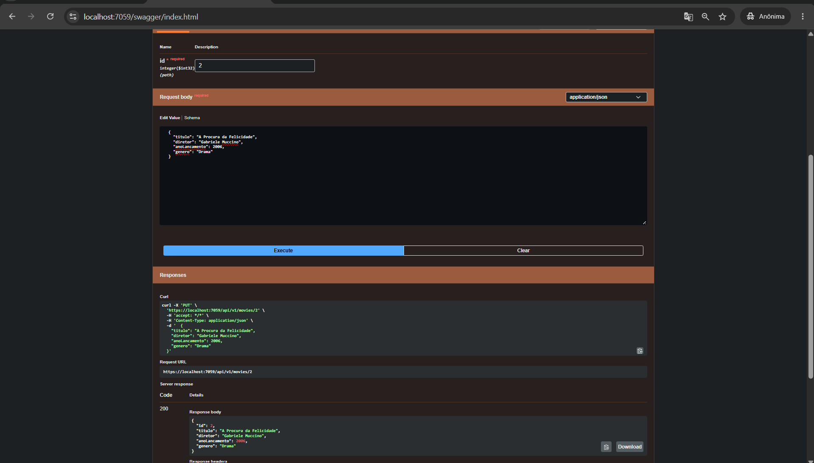
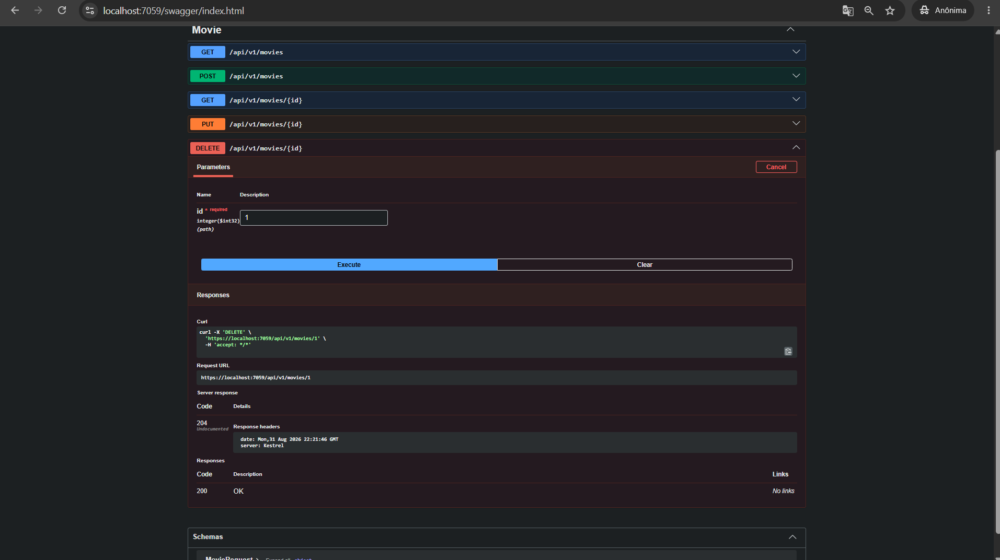
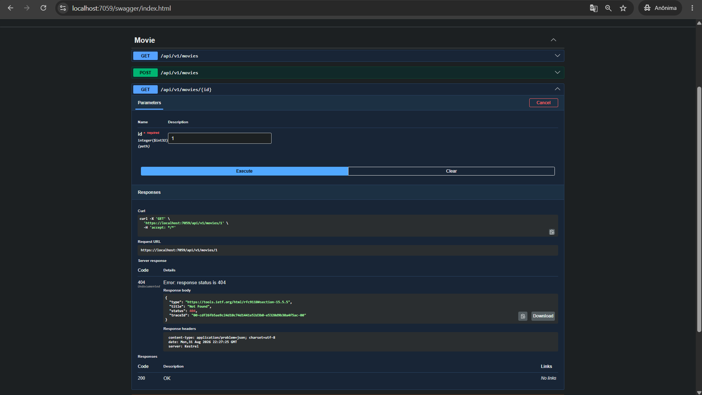

# MovieCatalog.API

## Tema e Objetivo

**Tema:** Catálogo de Filmes.

Esta Web API foi desenvolvida em **ASP.NET Core (.NET 10)** com o objetivo de gerenciar um catálogo de filmes, permitindo listar, buscar, cadastrar, atualizar e remover filmes através de operações CRUD completas, seguindo boas práticas de arquitetura (separação em Controllers, Models, DTOs e Data) e documentação via Swagger/OpenAPI.

## Integrantes

| Nome Completo | RM |
|---|---|
| Léo Masago | 557768 |
| Eduardo Tomazela | 556807 |
| Luiz Henrique Silva | 555235 |

## Arquitetura do Projeto

```
MovieCatalog.API/
├── Controllers/
│   └── MovieController.cs      # Endpoints da API (herda de Controller, [ApiController])
├── Models/
│   └── Movie.cs                 # Entidade de domínio
├── DTOs/
│   └── MovieRequest.cs          # DTO usado na criação/atualização (sem Id)
├── Data/
│   └── AppDbContext.cs          # "Banco de dados" em memória (lista de Movie), injetado como Singleton
└── Program.cs                   # Configuração da aplicação, DI e Swagger
```

### Entidade `Movie`

| Campo | Tipo | Descrição |
|---|---|---|
| `Id` | `int` | Identificador único (gerado pela API) |
| `Titulo` | `string` | Título do filme |
| `Diretor` | `string` | Diretor do filme |
| `AnoLancamento` | `int` | Ano de lançamento |
| `Genero` | `string` | Gênero do filme |

A persistência é simulada em memória através do `AppDbContext`, registrado no container de injeção de dependência como **Singleton** (`builder.Services.AddSingleton<AppDbContext>()`), mantendo os dados durante a execução da aplicação.

## Endpoints

Base URL: `/api/v1/movies`

| Verbo | Rota | Descrição | Códigos de retorno |
|---|---|---|---|
| `GET` | `/api/v1/movies` | Lista todos os filmes | `200 OK` |
| `GET` | `/api/v1/movies/{id}` | Busca um filme pelo Id | `200 OK` \| `404 Not Found` |
| `POST` | `/api/v1/movies` | Cria um novo filme | `201 Created` |
| `PUT` | `/api/v1/movies/{id}` | Atualiza um filme existente | `200 OK` \| `404 Not Found` |
| `DELETE` | `/api/v1/movies/{id}` | Remove um filme pelo Id | `204 No Content` \| `404 Not Found` |

## Instruções de Execução

### Pré-requisitos

- [.NET 10 SDK](https://dotnet.microsoft.com/download)

### Rodando a aplicação

```bash
cd MovieCatalog.API
dotnet restore
dotnet run
```

A aplicação sobe por padrão em:

- HTTPS: `https://localhost:7059`
- HTTP: `http://localhost:5293`

### Testando pelo Swagger

Com a aplicação rodando em ambiente de Desenvolvimento, acesse:

```
https://localhost:7059/swagger
```

A interface do Swagger permite executar todos os endpoints (`GET`, `POST`, `PUT`, `DELETE`) diretamente pelo navegador.

## Exemplos de Chamadas

### Listar todos os filmes

```bash
curl -k https://localhost:7059/api/v1/movies
```

### Buscar filme por Id

```bash
curl -k https://localhost:7059/api/v1/movies/1
```

### Criar um novo filme

```bash
curl -k -X POST https://localhost:7059/api/v1/movies \
  -H "Content-Type: application/json" \
  -d '{
    "titulo": "A Origem",
    "diretor": "Christopher Nolan",
    "anoLancamento": 2010,
    "genero": "Ficção Científica"
  }'
```

Resposta esperada: `201 Created`, com o filme criado (incluindo o `Id` gerado) no corpo da resposta.

### Atualizar um filme existente

```bash
curl -k -X PUT https://localhost:7059/api/v1/movies/1 \
  -H "Content-Type: application/json" \
  -d '{
    "titulo": "Scarface",
    "diretor": "Brian De Palma",
    "anoLancamento": 1983,
    "genero": "Crime/Drama"
  }'
```

### Remover um filme

```bash
curl -k -X DELETE https://localhost:7059/api/v1/movies/1
```

Resposta esperada: `204 No Content`.

## Prints dos Testes no Swagger

> Salve os prints em `docs/prints/` usando os nomes de arquivo indicados abaixo (basta arrastar cada imagem para a pasta com o nome correspondente).

**1. Tela inicial do Swagger**



**2. GET /api/v1/movies — listar todos (200)**



**3. GET /api/v1/movies/{id} — buscar por id existente (200)**



**4. GET /api/v1/movies/{id} — buscar por id inexistente (404)**



**5. POST /api/v1/movies — criar filme (201)**



**6. PUT /api/v1/movies/{id} — atualizar filme (200)**



**7. DELETE /api/v1/movies/{id} — remover filme (204)**



**8. GET /api/v1/movies/{id} — confirmação da remoção (404)**


